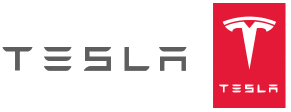

<p align="center">
       
</p>

## 💻 Project

The **Tesla-Clone** project is a Web application that consists of a replica of the interface of Tesla's company website.

<br/>

<p align="center">
    
</p>

## 🚀 Technologies

- React
- React-redux
- React-icons
- React-reveal
- Styled-components
- JavaScript

## ℹ️ How to Execute

- ### **Preconditions**
  - You must have Node.js installed on your computer.
  - You must have Git installed and configured on your computer.
  - Also, you need to have a package manager, either NPM or Yarn.

1. Make a clone of the repository:

```sh
  $ git clone https://github.com/Djaysson/Tesla-Clone-with-ReactJS.git
```

2. Application Execution:

```sh
  # Go to the project folder.
  $ cd Tesla-Clone-with-ReactJS
  # Installing the project dependencies.
  $ yarn install # or npm install
  # Run the app
  $ yarn start # or npm start
```

Made by Djayson Rodrigues 👋 [Linkedin](https://www.linkedin.com/in/djaysonrodrigues/)
